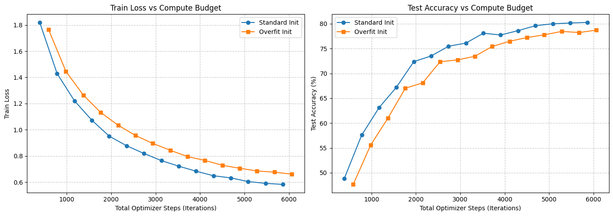
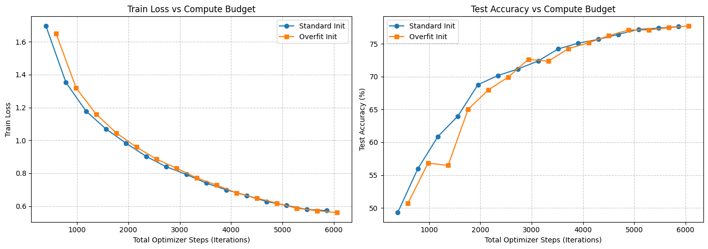
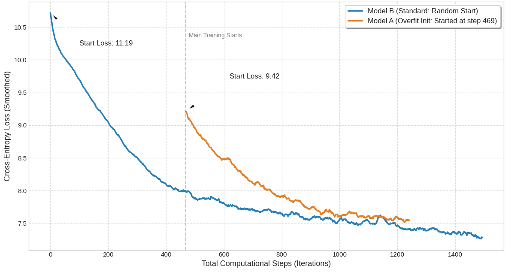
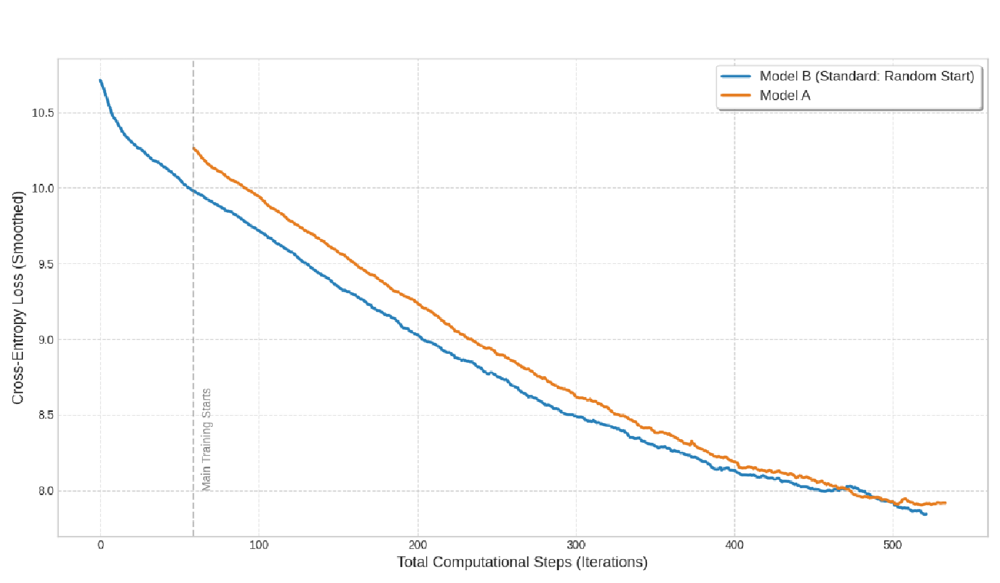

# Single-Batch Overfitting

Этот репозиторий содержит материалы исследования гипотезы: может ли оверфиттинг модели на изолированном батче ускорить сходимость при последующем обучении на полном датасете.

## Теоретическое обоснование и формулирование гипотезы

Традиционные подходы к инициализации, ориентированные на стабильность градиентов, часто оказываются неэффективными для сложных систем. При старте с нуля значительная часть ресурсов расходуется на обучение нейросети самым базовым закономерностям данных, что замедляет начальное время сходимости модели.

## CIFAR-10

Первая проверка гипотезы проводилась на задачах компьютерного зрения с использованием архитектур семейств ResNet и CNN на датасете CIFAR-10. 

Модель "A" обучалась в стандартном режиме. Модель "B" предварительно переобучалась на одном батче (500 итераций) до околонулевого значения функции потерь, после чего переводилась на полный датасет.

Статистика приведена с учётом итераций на начальный оверфиттинг.

В архитектуре с Batch Normalization скорость обучения остаётся идентичной, но single-batch проигрывает по эффективности из-за необходимости дополнительных шагов на инициализацию. 

Без слоёв нормализации метод даёт более оптимистичный результат, он даёт небольшое преимущество по сравнению с базовой моделью, но использовать его смысла нет.

## LLM pre-training

В отличие от изображений, выучить структуру языка с нуля гораздо сложнее. Претрейн LLM всегда требовал много времени и ресурсов. Предполагалось, что закрепление начального синтаксиса должно ускорить дальнейшую сходимость модели. 

Для тестирования гипотезы была использована архитектура [Baguettotron](https://huggingface.co/PleIAs/Baguettotron) (321M параметров, 80 слоев). Эксперимент проводился на англоязычном подмножестве синтетического датасета [PleIAs/SYNTH](https://huggingface.co/datasets/PleIAs/SYNTH).

Было проведено два замера с разным количеством итераций на инициализацию. Во всех случаях скорость сходимости предложенного метода был выше.

В отличие от тестов на CIFAR, здесь начальное ускорение оказалось настолько значимым, что лосс в итоге сравнялся с показателями бейзлайна, несмотря на существенное отставание по времени старта. В первом сценарии задержка составила 456 итераций, но лоссы смогли пересечься уже к тысячной итерации.

Тем не менее нужно учитывать, что на 456-й итерации лосс у бейзлайна уже составлял 8.0, а пересечение метрик произошло на уровне лосса 7.5-7.6.

 

## Выводы

#### Гипотеза требует дальнейшей проверки.

1. Чуть больше 1000 итераций для претрейна с нуля — это очень мало. Гипотеза может раскрыться в ходе дальнейшего обучения.
2. Можно предположить, что роль играет репрезентативность батча, который мы берём для инициализации. При тестировании был использовал случайный батч. 
3. Можно попробовать обучать на нескольких батчах, постепенно сокращая количество итераций.
